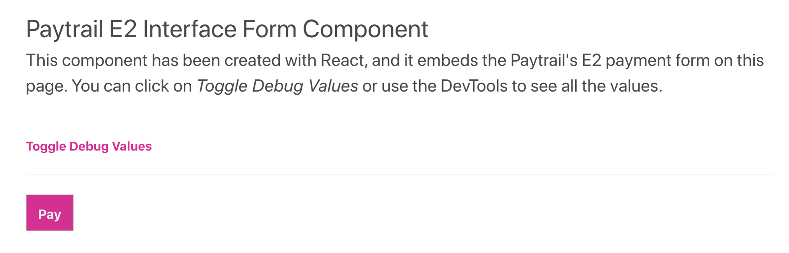

<h1 align="center">react-paytrail-e2 💸</h1>

[](https://badge.fury.io/js/react-paytrail-e2)


> React library and component for creating payments with [Paytrail E2 Interface][e2].

## Introduction



This library outputs a new `<form>` HTML element including all the required and optional fields as `<input>` elements for the E2 interface. Authcode required by Paytrail is calculated dynamically on render.

Payment may be dispatched to the service by submitting the form. Invalid parameters will instantly be caught by the payment service.

⚠️ This is still a **work-in-progress**. We appreciate your help in testing the logic and fixing any defects found. See how to [contribute](#contributing).

## Install

```sh
# Yarn
yarn add react-paytrail-e2

# NPM
npm install --save react-paytrail-e2
```

## Usage

The payment form component should be added to your existing order page.

```jsx
import { Form } from '@paytrail/react-paytrail-e2'

/* order page JSX */

<Form {...props} />
```

## Demo

This project includes [a demo React application](example/src/App.js) which you can use to study the on how to pass different properties to this component.

## Contributing

The library source code can be found under the `src/` directory, and the example app under the `example/` directory.

First, install dependencies with `yarn`. Then invoke a _Jest_ watcher with `yarn test:unit` to validate your changes.

**NOTE:** As of yet, there's no automated end-to-end test suite for creating a real payment. Make sure the demo application can create a new payment by click of a button and there are no interface errors.

After you're satisfied with the changes and all tests pass, open a pull request to this project.

## Releases

Follow the steps below to release a new version:

> **NOTE:** GitHub Actions pipeline automatically pushes new releases to GitHub package registry when a new release is published. Currently, there's no automatic publishing to NPM registry so it has to be handled manually as below.

1. Install the [`np`][np] tool by running `npm install -g np`.
2. Type `np` in the project root and select the version bump (_patch_, _minor_, or _major_) according to semantic versioning.
3. See that all the automated release steps are executed successfully.
4. Fill the GitHub Releases draft and publish the release notes.
5. Check that [NPM][npm] contains the new version.

[e2]: https://docs.paytrail.com/payments/e2-interface/
[np]: https://github.com/sindresorhus/np
[npm]: https://www.npmjs.com/package/@paytrail/react-paytrail-e2
